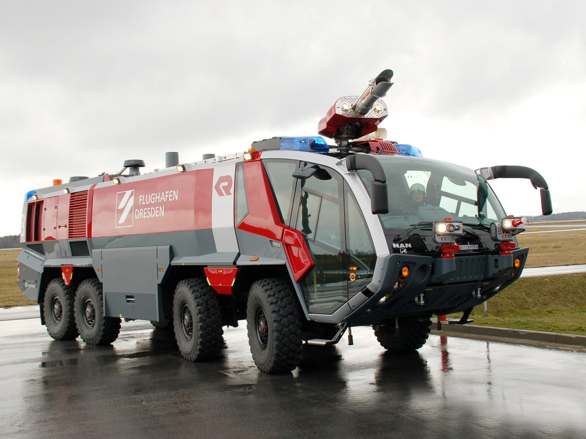
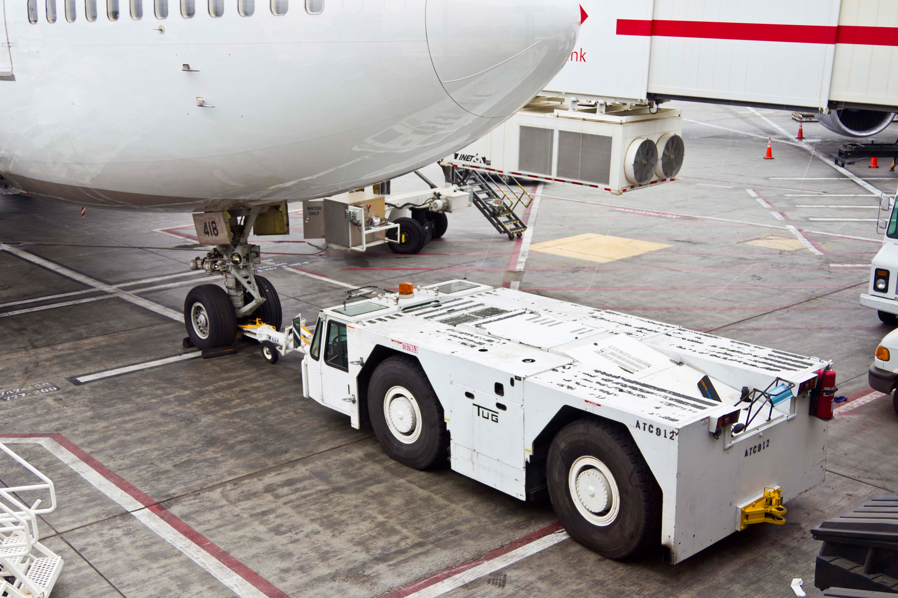

# Some stuff I like

Here's just a bunch of links or images of stuff I like, maybe with a description of why I like it.

https://www.youtube.com/embed/e9DfSCk-6Ko

First of all, this is just an amazing video. But if you pause on the "keyframes" of the different sleeves, each of them has that certain character about it. The combinations of the colours, font, angles and line weight come together. It could be that this video is just playing on creating fake nostalgia for physical media.

https://www.artstation.com/pao

Paul Chadeisson's work is fantastic, and I just like space. There's something about behemoth scaled structures that tickle me. Not sure how this relates to UI design though.

https://vb-audio.com/Voicemeeter/banana.htm

The VB-audio voicemeter suite of software is pretty comparable to what I want to create. A UI that is set in stone and serves its purpose well. though these applications can be a bit confusing at times.

 

For some reason I like these highly specialized airport vehicles. I can't tell you why. I'm otherwise not into cars.

